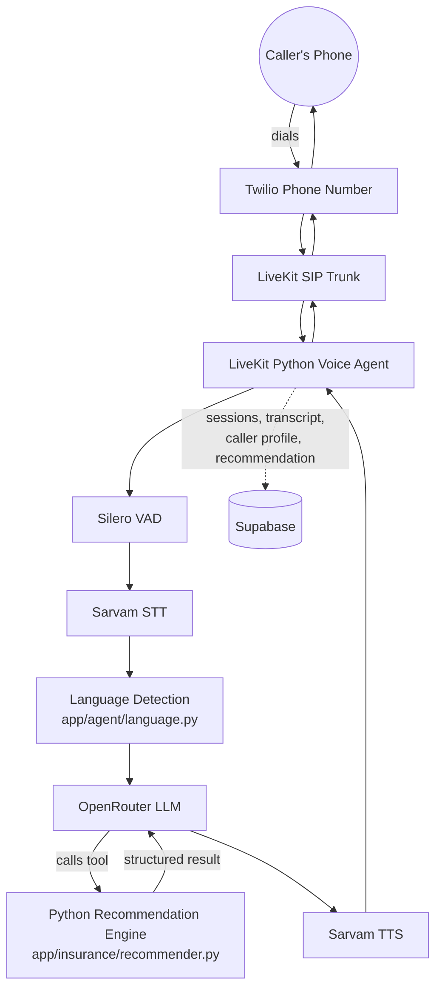

# Multilingual Health Insurance Voice Bot

## Overview

A demo AI voice bot for a **fictional** health insurance company ("SecureLife Demo Insurance").
A caller phones a Twilio number, has a natural spoken conversation in English, Hindi, Marathi,
Tamil, or Kannada (auto-detected, no "switch to Hindi" command needed), and the bot:

1. Collects relevant information (name, age, city, family, existing conditions, budget, etc.).
2. Runs that information through a **deterministic Python rules engine** against a small
   fictional policy catalogue.
3. Explains the recommendation naturally, in whichever language the caller is using.
4. Saves the full transcript and recommendation to Supabase.
5. Exposes a small read API to retrieve a completed call's data.

This is an MVP/demo project built to be easy to read, run, and explain in an interview — not a
production platform.

## Features

- Real-time voice interaction over a phone call (Twilio → LiveKit SIP → LiveKit Agent)
- Silero VAD for natural turn-taking
- Sarvam AI for speech-to-text and text-to-speech, natively covering all 5 required languages
- OpenRouter for the conversational LLM (model swappable via `.env`, no code changes)
- Automatic language detection and mid-call language switching, no explicit command required
- Deterministic, unit-tested policy recommendation engine — the LLM never picks the policy
- Supabase persistence of sessions, caller profiles, recommendations, and transcripts
- FastAPI read API for retrieving a completed session's full result

## Architecture



The FastAPI process (`app/main.py`) is a separate, stateless read path that queries Supabase
directly — it does not talk to the voice agent process.

## Recommendation Design (read this first)

**The LLM does not decide which policy to recommend.** It only:

1. Understands natural, multilingual/code-switched speech.
2. Extracts structured caller information via a validated tool call (`record_customer_info`
   in `app/agent/tools.py`, backed by the Pydantic model `CustomerRequirementsUpdate`).
3. Asks follow-up questions and manages conversational flow.
4. Calls `get_policy_recommendation` (also in `app/agent/tools.py`) to obtain a recommendation,
   then explains that result in natural language, in the caller's current language.

A deterministic, side-effect-free Python function — `recommend_policy()` in
`app/insurance/recommender.py` — is the **only** thing that selects a policy. It loads the
policy catalogue (`app/insurance/policies.json`), filters out policies that violate hard
constraints (family size, max age, requested coverage, budget), scores the remainder, and
returns a structured result with reasons. `recommender.py` makes no LLM/network calls and has
100% deterministic, unit-tested behavior (see `tests/test_recommender.py`).

The LLM is explicitly instructed to use **only** the facts in that structured result when
explaining it to the caller, and to say plainly when something isn't in the catalogue rather
than invent it.

## Supported Languages

| Code | Language |
|------|----------|
| `en` | English |
| `hi` | Hindi |
| `mr` | Marathi |
| `ta` | Tamil |
| `kn` | Kannada |

## Tech Stack

| Layer | Technology | Responsibility |
|---|---|---|
| API framework | FastAPI + Pydantic | Read API, data validation |
| Voice orchestration | LiveKit Agents (Python SDK) | Session/pipeline orchestration |
| Telephony | Twilio phone number + LiveKit SIP | Inbound call → LiveKit room |
| VAD | Silero (via `livekit-plugins-silero`) | Turn detection |
| STT + TTS | **Sarvam AI** (via `livekit-plugins-sarvam`) | Speech recognition & synthesis, see note below |
| LLM | OpenRouter (OpenAI-compatible API) | Conversation, extraction, explanation |
| Language detection | Script detection + marker words + `langdetect` | Per-turn language routing, see `app/agent/language.py` |
| Recommendation engine | Plain Python (`app/insurance/recommender.py`) | Deterministic policy selection |
| Database | Supabase (Postgres) | Session/transcript/recommendation persistence |
| Testing | pytest | Unit tests |

### Why Sarvam AI instead of Deepgram for STT/TTS

The original brief specified Deepgram. While implementing, we checked the actual, currently
installed `livekit-plugins-deepgram` (v1.6.10) API surface and found two hard blockers for this
project's core requirement:

- **Deepgram STT** has no model for Marathi (`mr`) or Kannada (`kn`) — only `en`, `hi`, and `ta`
  are available among our five required languages.
- **Deepgram TTS (Aura)** ships English-only voices (every model name ends in `-en`) — it
  cannot speak any of the four Indian languages at all.

**Sarvam AI** (`livekit-plugins-sarvam`, same LiveKit plugin release train) natively supports
STT (`saarika`/`saaras` models) and TTS (`bulbul` model) for exactly `en-IN, hi-IN, mr-IN, ta-IN,
kn-IN` — our full required language set — with a single API key, the same integration shape as
Deepgram would have had. This is a like-for-like swap: both are isolated entirely inside
`app/agent/agent.py`, so switching providers again later only touches that one file.

## Project Structure

```
app/
├── main.py                # FastAPI app (read API)
├── config.py               # Centralized env-based settings
├── agent/
│   ├── agent.py            # LiveKit entrypoint: wires VAD/STT/LLM/TTS, the only LiveKit-aware module
│   ├── prompts.py           # System prompt, greetings, extraction/explanation prompt templates
│   ├── language.py          # Offline language detection heuristic
│   ├── tools.py              # LLM-callable tools (record_customer_info, get_policy_recommendation)
│   ├── llm.py                 # OpenRouter LLM client factory
│   └── state.py                # Per-call userdata (SessionManager + LanguageTracker)
├── insurance/
│   ├── policies.json        # Fictional demo policy catalogue (source of truth)
│   ├── models.py             # Policy / CustomerRequirements / RecommendationResult Pydantic models
│   └── recommender.py         # Deterministic recommendation engine (no LLM calls)
├── database/
│   ├── client.py             # Supabase client construction
│   └── repository.py          # All Supabase queries live here, nowhere else
├── sessions/
│   ├── models.py              # Runtime CallSession / TranscriptMessage models
│   └── manager.py              # In-call orchestration + best-effort persistence
└── api/
    └── routes.py               # GET /health, /sessions, /sessions/{id}

supabase/schema.sql        # Table definitions
tests/                      # pytest suite
requirements.txt
.env.example
```

## Prerequisites

You'll need accounts/credentials for:

- **Twilio** — a phone number for inbound calls
- **LiveKit** (Cloud or self-hosted) — voice orchestration + SIP
- **Sarvam AI** — STT/TTS ([sarvam.ai](https://sarvam.ai))
- **OpenRouter** — LLM access
- **Supabase** — Postgres database

None of these are required just to run the API and test suite locally (see "Local Development"
below) — only to actually place a phone call.

## Environment Variables

Copy `.env.example` to `.env` and fill in real values. `.env` is gitignored and must never be
committed.

```
LIVEKIT_URL=
LIVEKIT_API_KEY=
LIVEKIT_API_SECRET=

TWILIO_ACCOUNT_SID=
TWILIO_AUTH_TOKEN=
TWILIO_PHONE_NUMBER=

SARVAM_API_KEY=

OPENROUTER_API_KEY=
OPENROUTER_MODEL=openai/gpt-4o-mini

SUPABASE_URL=
SUPABASE_KEY=
```

Use the Supabase **service role** key (`SUPABASE_KEY`), since all Supabase access happens
server-side in the agent/API processes only. There is no frontend in this project, so the
service key is never exposed to a browser.

## Supabase Setup

1. Create a project at [supabase.com](https://supabase.com).
2. Open the SQL editor and run the contents of [`supabase/schema.sql`](supabase/schema.sql).
   This creates `sessions`, `caller_profiles`, `recommendations`, and `transcript_messages`.
3. In your project's API settings, copy the **Project URL** (`SUPABASE_URL`) and the
   **service_role** secret key (`SUPABASE_KEY`).
4. Paste both into `.env`.

The app works without Supabase configured — the API returns `503` on the `/sessions*` routes
and the voice agent falls back to in-memory-only sessions with a logged warning (see
`app/sessions/manager.py`), which is what makes local testing possible without a live project.

## Local Development

Requires Python 3.11+.

```bash
python -m venv .venv

# Activate:
# Windows (PowerShell): .venv\Scripts\Activate.ps1
# Windows (cmd):        .venv\Scripts\activate.bat
# macOS/Linux:           source .venv/bin/activate

pip install -r requirements.txt

cp .env.example .env   # then fill in values as needed

uvicorn app.main:app --reload
```

The API is now at `http://127.0.0.1:8000` (`/docs` for interactive Swagger UI).

### Starting the voice agent

The voice agent is a separate long-running worker process, started via the LiveKit Agents CLI:

```bash
python -m app.agent.agent dev     # local dev mode, connects to LiveKit and waits for jobs
python -m app.agent.agent start   # production-style run
```

This requires `LIVEKIT_URL`, `LIVEKIT_API_KEY`, `LIVEKIT_API_SECRET`, `SARVAM_API_KEY`, and
`OPENROUTER_API_KEY` to be set in `.env` — it will raise a clear error naming the missing
variable if not.

## Twilio + LiveKit SIP Setup

This part is genuine third-party dashboard configuration — it cannot be done from application
code, and this README will not pretend otherwise.

1. **LiveKit project**: create a project at [cloud.livekit.io](https://cloud.livekit.io) (or
   self-host) and note its SIP URI (Project Settings → SIP, or via `lk` CLI).
2. **Twilio number**: buy/use a Twilio phone number capable of voice.
3. **Twilio Elastic SIP Trunk**: in the Twilio console, create a SIP trunk (Elastic SIP
   Trunking), set its **Origination URI** to your LiveKit SIP URI (e.g.
   `sip:<your-project>.sip.livekit.cloud;transport=tcp`), and associate your Twilio number with
   that trunk.
4. **LiveKit inbound trunk**: create a LiveKit SIP inbound trunk that accepts calls from your
   Twilio number, using the LiveKit CLI (`lk sip inbound-trunk create`) or dashboard, per
   [LiveKit's SIP documentation](https://docs.livekit.io/sip/).
5. **Dispatch rule**: create a LiveKit SIP dispatch rule that routes inbound SIP calls into a
   room and dispatches this project's agent (`agent_name="insurance-voice-agent"`, set in
   `app/agent/agent.py`) into that room.
6. **Run the agent worker** (`python -m app.agent.agent start`) so it's online and able to
   accept the dispatched job when a call comes in.

Exact CLI flags and JSON payloads change over time — follow LiveKit's current SIP + Twilio
trunk guide for the authoritative, up-to-date commands rather than a copy pasted here.

## Testing

```bash
pytest -q
```

All 44+ tests run fully offline — Supabase, LiveKit, Sarvam, and OpenRouter are all mocked or
simply not required for the recommendation engine, model validation, language detection, and
API tests.

## Calling the Bot

1. Complete the Twilio + LiveKit SIP setup above.
2. Start the agent worker: `python -m app.agent.agent start`.
3. Dial your Twilio number from any phone.
4. The bot greets you, asks a few natural questions, and — once it has enough signal (coverage,
   budget, or family size) — gives you a demo recommendation and hangs up when the conversation
   ends.
5. Fetch the result: `GET /sessions/{session_id}` (the session ID is logged by the agent
   process, and also derivable from the LiveKit room name).

## Session Output

Example `GET /sessions/{session_id}` response:

```json
{
  "id": "6f1c1e0a-2a3e-4b8b-9b0e-6a2b8f8b6a10",
  "livekit_session_id": "room_8f2a91",
  "call_id": null,
  "started_at": "2026-08-17T10:02:11Z",
  "ended_at": "2026-08-17T10:06:47Z",
  "status": "completed",
  "primary_language": "hi",
  "detected_languages": ["en", "hi"],
  "requirements": {
    "name": "Rahul",
    "age": 34,
    "city": "Pune",
    "family_size": 4,
    "family_members": [
      {"relationship": "spouse", "age": 31},
      {"relationship": "child", "age": 6},
      {"relationship": "child", "age": 3}
    ],
    "existing_conditions": [],
    "existing_insurance": false,
    "desired_coverage": 1000000,
    "annual_budget": 25000
  },
  "recommendation": {
    "eligible": true,
    "policy_id": "health_plus",
    "policy_name": "Health Plus",
    "coverage": 1000000,
    "annual_premium": 22000,
    "reasons": [
      "Meets the requested ₹10,00,000 coverage",
      "Annual premium of ₹22,000 is within the stated budget",
      "Covers the caller's family size of 4"
    ]
  },
  "transcript": [
    {"speaker": "assistant", "text": "Hi, thanks for calling SecureLife Demo Insurance!...", "language": "en", "timestamp": "2026-08-17T10:02:12Z"},
    {"speaker": "user", "text": "Mera naam Rahul hai, main 34 saal ka hoon...", "language": "hi", "timestamp": "2026-08-17T10:02:20Z"}
  ]
}
```

## Example Conversation

**English**

> **Bot:** Hi, thanks for calling SecureLife Demo Insurance! I'm Maya... Could I start with your name?
> **Caller:** My name is Rahul, I'm 34, and I want insurance for myself, my wife, and two kids.
> **Bot:** Great to meet you, Rahul. So that's 4 people to cover. Do you have a rough coverage amount or annual budget in mind?
> **Caller:** Around 10 lakh coverage, budget maybe 25 thousand a year.
> **Bot:** Got it — based on that, our Health Plus plan looks like the best fit. It covers ₹10,00,000, costs ₹22,000 a year, and supports your family size...

**Hindi**

> **Caller:** मुझे अपने परिवार के लिए हेल्थ इंश्योरेंस चाहिए।
> **Bot:** *(responds in Hindi, asks who's in the family and roughly what budget they have)*
> **Caller:** My budget is twenty thousand.
> **Bot:** *(detects the switch back to English and responds in English)*

## Limitations

- All policies in `app/insurance/policies.json` are **fictional demo data**, not real insurance
  products, and this bot does not provide real insurance or financial advice.
- Language detection (`app/agent/language.py`) uses an offline heuristic (Unicode script +
  marker words + `langdetect`) rather than a full statistical/LLM classifier per utterance; it
  can misclassify heavily code-mixed sentences or very short replies (it falls back to the
  previous turn's language in that case).
- Sarvam AI's STT language auto-detection and TTS voice quality for Marathi/Kannada/Tamil have
  not been evaluated against real call audio as part of this build — that requires a live
  Sarvam account and real calls.
- No authentication on the FastAPI read endpoints — fine for a local demo, not for any public
  deployment.
- A production deployment would need real authentication/authorization, observability
  (structured logging, tracing, alerting), rate limiting, retry/backoff on all external calls,
  data-retention and consent policies for recorded call data, and compliance review — none of
  which are in scope for this MVP.
